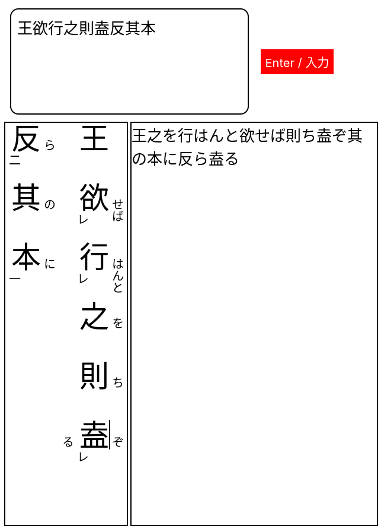
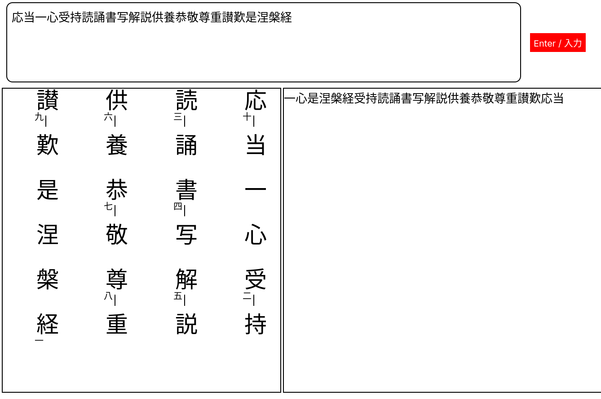
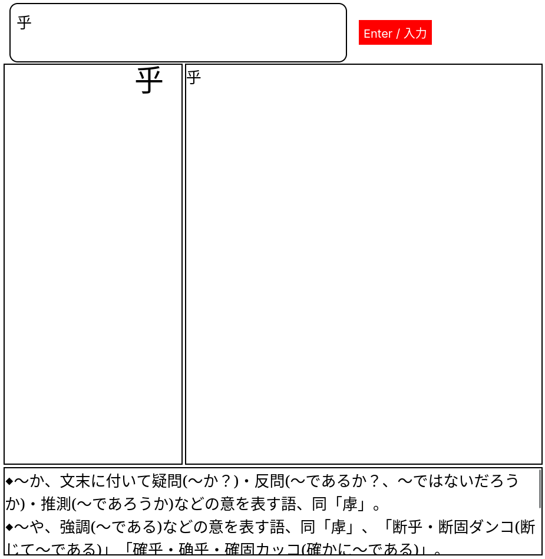

# kundokubungo
訓読文語 – a go tool for going between 訓読文 and 書き下し文

---

Kundokubungo is a tool to automatically display 白文 in 縦書き and allow for inputs of 返り点 and 送り仮名 to automatically convert to 書き下し, with options for 再読文字 and 熟語, represented by a vertical line to the right and just below the first character of the 熟語 respectively. 

再読|熟語
:--:|:--:
 | 


## How to use

- Enter 白文 in the text box at the top and click "Enter / 入力"
- The text should appear in both boxes below (縦書き left and 書き下し文 right)
- On hovering over a character, there should appear 2 buttons (labelled 塾 and 再) and three text boxes.
  - 塾 should show a line below the character, indicating that it and the character below are a 熟語. You do not need to click 塾 on the character below.
  - 再 should show a line to the right of the character, indicating that it is a 再読文字
  - The left most text box is the second 送り仮名 (only applicable to 再読文字)
  - The second text box is for the [返点](#返り点)
  - The right most text box is for the first 送り仮名
- The right box should then update with the correct 書き下し文 when either a button is clicked or when a text box loses focus.

### Dictionary

I've included a dictionary lookup feature, although no dictionary database is provided. Based on what I've found to be most useful, I suggest [漢字林](https://ksbookshelf.com/DW/Kanjirin/index.html). The database schema is based on that (see `sql/schema.sql`). The box at the bottom shows the meaning upon clicking a character:



If you wish to change the dictionary table structure, install SQLC to regenerate `internal/database/`.

```
go install github.com/sqlc-dev/sqlc/cmd/sqlc@latest;
sqlc generate
```

Then change the character handler and JavaScript accordingly.

### Setup
- Clone the directory:

```
git clone https://github.com/JoStMc/kundokubungo
```

- Ensure you have the latest version of Go: https://go.dev/dl/

- For dictionary functionality, make sure you have [PostgreSQL](https://www.postgresql.org/) installed and make a database with your desired dictionary based on the schema at `sql/schema.sql`, setting your `.env` variable `DB_PATH` to the database.

- Start the server `cd kundokubungo; go run .`

- The server should be available on the port number defined in `.env` (ex. `PORT="8091"`) at `http://localhost:{PORT}/app/`.

## 返り点

#### レ点
Character is parsed after the subsequent character.

#### 一二(三)点
Each number is not parsed until the previous number has been parsed. 一 can be combined with レ (一レ).

**Note:** Apparently there is at least one instance where there is a sentence which goes up to 九, then 下; this may be a mistake, so in any case where the tenth is 下, it should be replaced with 十. 

Full: 一二三四五六七八九十

#### 上(中)下点
Each is parsed only once the previous mark has been parsed – 中 may be omitted. These are typically used to wrap 一二. 上 can be combined with レ (上レ).

#### 甲乙(丙)点
Each is parsed only once the previous mark has been parsed. Typically they wrap 上(中)下, but they may be swapped with 天地人 since there are only 3 marks in the sequence. The sequence only goes to 己 as is. I will add more if I come across a passage which uses more.

Full: 甲乙丙丁戊己庚辛壬癸

#### 天地(人)点
Each is parsed once the previous mark has been parsed. Typically these wrap 甲乙(丙)点.

#### 元亨(利貞)点
Each is parsed once the previous mark has been parsed. Typically these wrap 天地(人)点.

#### 乾坤点
Each is parsed once the previous mark has been parsed. Typically these wrap  元亨(利貞)点


### 竪点
A hyphen which ties together 2 characters (熟語), shown as a line to the right of 返り点.

### 再読文字
Characters which are read twice; once as if the 返り点 were not there, then again with the usual 返り点 behaviour. This will be represented by a vertical line to the right of the character, and the second reading's 送り仮名 will be to the left of the 返り点.
